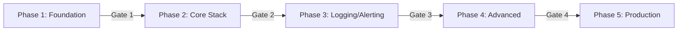

# ODIN Kubernetes Deployment Strategy

## Executive Summary

This deployment strategy outlines the approach for successfully implementing ODIN on Kubernetes, addressing the failures from the Docker deployment and leveraging K8s native features for reliability and scalability.

## Strategic Objectives

1. **Eliminate Networking Complexity**: Use Kubernetes DNS and service discovery
2. **Ensure High Availability**: Implement proper health checks and restarts
3. **Enable Easy Rollbacks**: Use declarative configurations and version control
4. **Maintain GPU Support**: Leverage NVIDIA device plugin and runtime
5. **Implement GitOps**: Infrastructure as code with automated deployments

## Deployment Approach

### 1. Phased Rollout Strategy

**Phase-Gate Approach**: Each phase must meet success criteria before proceeding



### 2. Environment Strategy

#### Development Environment (Local K3s)
- Single-node K3s on Razer Blade 18
- Reduced resource allocations
- Frequent deployments for testing
- Data persistence not critical

#### Production Environment (Future)
- Multi-node cluster option
- Full resource allocations
- GitOps-driven deployments
- Data replication and backups

### 3. Technology Stack Decisions

| Component | Technology | Rationale |
|-----------|------------|-----------|
| Kubernetes | K3s | Lightweight, perfect for development |
| Deployment | Helm + Kustomize | Helm for packaging, Kustomize for customization |
| CI/CD | GitHub Actions | Native GitHub integration |
| Monitoring | Prometheus | Industry standard, K8s native |
| Visualization | Grafana | Best-in-class dashboards |
| Logging | Loki | Lightweight, integrates with Grafana |
| GPU Monitoring | NVIDIA DCGM | Official NVIDIA solution |

## Implementation Plan

### Week 1-2: Foundation (Phase 1)
```bash
# Key Activities
- Install K3s with GPU support
- Setup storage and networking
- Create Helm charts structure
- Implement basic CI/CD
```

### Week 3-4: Core Monitoring (Phase 2)
```bash
# Key Activities
- Deploy Prometheus/Grafana
- Configure exporters
- Create dashboards
- Validate GPU metrics
```

### Week 5-6: Logging & Alerting (Phase 3)
```bash
# Key Activities
- Deploy Loki/Promtail
- Setup AlertManager
- Configure notifications
- Create runbooks
```

### Week 7-8: Advanced Features (Phase 4)
```bash
# Key Activities
- Service mesh evaluation
- Tracing implementation
- Custom exporters
- Performance optimization
```

### Week 9-10: Production Ready (Phase 5)
```bash
# Key Activities
- HA configuration
- Security hardening
- Documentation
- Training/handover
```

## Risk Mitigation Strategies

### Technical Risks

1. **GPU Compatibility Issues**
   - Mitigation: Test early with GPU workloads
   - Fallback: Use Docker runtime if needed
   - Validation: Daily GPU metric checks

2. **Storage Performance**
   - Mitigation: Use local SSD storage
   - Fallback: External storage options
   - Monitoring: Disk I/O metrics

3. **Network Complexity**
   - Mitigation: Start with ClusterIP services
   - Fallback: NodePort for external access
   - Documentation: Network flow diagrams

### Operational Risks

1. **Configuration Drift**
   - Mitigation: GitOps with ArgoCD (future)
   - Control: All changes via Git
   - Audit: Configuration tracking

2. **Data Loss**
   - Mitigation: PVC with proper reclaim policy
   - Backup: Automated daily backups
   - Testing: Regular restore drills

## Success Metrics

### Phase Gate Criteria

#### Gate 1 (Foundation → Core)
- [ ] K3s cluster healthy
- [ ] GPU detected and accessible
- [ ] Storage provisioning working
- [ ] CI/CD pipeline functional

#### Gate 2 (Core → Logging)
- [ ] All exporters reporting
- [ ] Dashboards loading < 2s
- [ ] GPU metrics available
- [ ] Data persisting 24h+

#### Gate 3 (Logging → Advanced)
- [ ] Logs searchable in Grafana
- [ ] Alerts firing correctly
- [ ] Notifications working
- [ ] < 1min log ingestion delay

#### Gate 4 (Advanced → Production)
- [ ] All advanced features stable
- [ ] Performance baselines met
- [ ] Security scan passed
- [ ] Documentation complete

## Deployment Checklist

### Pre-Deployment
- [ ] Backup existing configurations
- [ ] Document current state
- [ ] Verify prerequisites
- [ ] Team alignment meeting

### During Deployment
- [ ] Follow runbooks exactly
- [ ] Monitor resource usage
- [ ] Test after each component
- [ ] Document any deviations

### Post-Deployment
- [ ] Validate all metrics
- [ ] Run smoke tests
- [ ] Update documentation
- [ ] Team retrospective

## Rollback Procedures

### Component-Level Rollback
```bash
# Helm rollback
helm rollback odin-monitoring [REVISION]

# Kustomize rollback
git checkout [PREVIOUS_COMMIT]
kubectl apply -k k8s/overlays/dev
```

### Full Stack Rollback
```bash
# Emergency rollback script
./scripts/emergency-rollback.sh
```

## Communication Plan

### Stakeholder Updates
- Weekly progress reports
- Phase completion announcements
- Issue escalation procedures
- Success celebration plan

### Documentation Requirements
- Architecture diagrams
- Runbook for each component
- Troubleshooting guides
- Video tutorials

## Long-Term Vision

### 6-Month Goals
- Multi-cluster support
- Cloud provider integration
- Advanced ML metrics
- Custom business dashboards

### 12-Month Goals
- Full production deployment
- Multi-tenancy support
- Cost optimization
- Compliance automation

## Conclusion

This strategy leverages Kubernetes native features to solve the networking and deployment issues encountered with Docker. By following a phased approach with clear gates and success criteria, we ensure a reliable and scalable monitoring solution.

### Key Success Factors
1. **Incremental Progress**: Small, validated steps
2. **Testing First**: Every component tested before integration
3. **Documentation**: Clear guides for operations
4. **Team Knowledge**: Training throughout deployment
5. **Automation**: CI/CD from day one

### Next Steps
1. Review and approve strategy
2. Assign team members to phases
3. Begin Phase 1 implementation
4. Schedule weekly progress reviews
5. Prepare celebration for go-live!